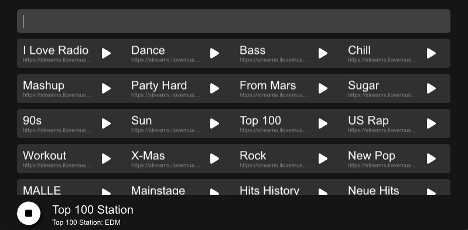

# Radar

A simple radio client powered with #Rust and #MadeWithSlint



## Building

To build this project, prefer to use this command to remove the command line on windows.

```bash
cargo rustc --release -- -Clink-args="/SUBSYSTEM:WINDOWS /ENTRY:mainCRTStartup"
```